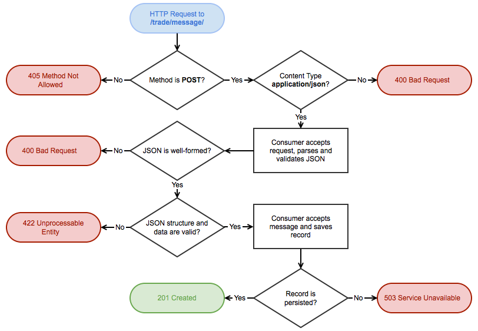

# Message Consumer

* Author: Darragh Enright <darraghenright@gmail.com>
* Date: 2015-08-29

## Description

As a component of the **Market Trade Processor**, the **Message Consumer** provides a HTTP endpoint to consume **Trade Message** data.

Messages are submitted to the Message Consumer via method `POST` to the endpoint `/trade/message/`.

## Lifecycle

The lifecycle of a Trade Message is the cycle in which a HTTP request received by the Message Consumer is handled, and an appropriate HTTP response is generated and returned to the originating client.

The following diagram documents the lifecycle and possible outcomes of a single HTTP request:



### Request

Trade Message data comprises the `POST` payload of the HTTP request received by the Message Consumer. A valid request:

* is received via method `POST`
* may be anonymous (as no `Authorization` is specified)
* includes `Content-Type` header `application/json`
* contains a well-formed JSON payload
* contains a JSON payload that validates to an expected format


### Response

The Message Consumer handles the request and responds with an appropriate HTTP response as per the documented flow.

The requesting client can determine the outcome from the response status code; e.g: `201 Created`. Additionally, each response is of type `application/json` and contains a `message` body that describes the outcome in greater detail; e.g:

````
{
    "message": "Syntax error, malformed JSON"
}
````

In this case, a Trade Message could not be parsed due to incorrect format - this message would accompany a HTTP Status Code of `400 Bad Request`.

#### Summary 

A summary of all expected HTTP Response Codes returned by the Message Consumer component is as follows:

* `405 Method Not Allowed` for all requests that are not method `POST`
* `400 Bad Request` if Content Type is incorrect
* `400 Bad Request` if JSON payload is malformed and cannot be parsed
* `422 Unprocessable Entity` if JSON payload does not validate to expected structure
* `503 Service Unavailable` for persistence issues; e.g: database outage
* `201 Created` for successful persistence

## Structure and Data

### Overview

A valid request contains a well-formed JSON payload that validates to an expected format. An example JSON payload is as follows:

```
{
    "userId": "134256",
    "currencyFrom": "EUR",
    "currencyTo": "GBP",
    "amountSell": 1000,
    "amountBuy": 747.10,
    "rate": 0.7471,
    "timePlaced": "24­JAN­15 10:27:44",
    "originatingCountry": "FR"
}
```

A JSON payload that does not strictly comply to this structure will return a HTTP Status Code of `422 Unprocessable Entity`. The JSON structure provided is considered invalid if:

* any *expected* fields are missing
* any *unexpected* fields are present

### Data Validation

Values for all fields are required. The JSON data provided is considered invalid if any field is blank. Based on the example JSON payload provided, valid data for each field is:

* `userId` - `string`
* `currencyFrom` - `string` corresponding to 3-digit ISO 4217 Currency Code
* `currencyTo` - `string` corresponding to 3-digit ISO 4217 Currency Code
* `amountSell` - unsigned numeric value (`float` or `integer`)
* `amountBuy` - unsigned numeric value (`float` or `integer`)
* `rate` - unsigned numeric value (`float` or `integer`)
* `timePlaced` - type `string` corresponding to date format `j-M-y H:i:s`
* `originatingCountry` - type `string` corresponding to 2-digit ISO 3166-1 Alpha-2 Country Code

*ISO Code Data Sources:*

* [ISO 4217 Currency Codes (.csv)](http://data.okfn.org/data/core/currency-codes/r/codes-all.csv)
* [ISO 3166-1 Alpha-2 Country Codes](http://data.okfn.org/data/core/country-codes/r/country-codes.csv)

### Data Transformation and Additional Validation

Convert to centesimal?

The following data will be transformed prior to data persistence:

* `amountSell` will be converted into an `integer` value representing 
* `timePlaced` will be reformatted according to MySQL's `datetime` format; i.e: `Y-m-d H:i:s`


The provided `rate` and `amountSell` can be used to determine the provided `amountBuy` - therefore this will also be validated